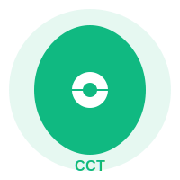

# CarbonDesci Platform

<div align="center">
  
</div>

CarbonDesci is the world's first DeSci platform that connects environmental science research with blockchain technology, focusing on carbon credit management and sustainable development research.

**Slogan:** "Decentralize Science, Sustain Earth"

<div align="center">
  
  [](https://opensource.org/licenses/MIT)
  [](https://nodejs.org/)
  [](https://reactjs.org/)
  [](https://www.mongodb.com/)
  [](https://web3js.readthedocs.io/)
  [](https://www.typescriptlang.org/)
  [](https://tailwindcss.com/)
</div>

## Core Features

* **Carbon Credit Management System (CarbonCore)**: Real-time carbon credit tracking, verification, and trading
* **Decentralized Research Funding**: Transparent proposal submission and community-driven funding
* **Environmental Data Platform**: Secure data collection, validation, and reward system
* **AI-Powered Analysis**: Automated data verification and impact assessment
* **Web3 Native Interface**: Mobile-first DApp with comprehensive dashboard

## Technical Stack

* **Frontend**: React.js, TypeScript, TailwindCSS
* **Backend**: Node.js, Express.js, MongoDB
* **Blockchain**: Multi-chain support (Ethereum, Polygon)
* **Storage**: IPFS/Arweave
* **AI/ML**: TensorFlow.js for data analysis

## Technical Architecture

CarbonDesci follows a modular, scalable architecture designed to integrate environmental science research with blockchain technologies:

```
┌─────────────────────────────────────────────────────────────────┐
│                     Client Application Layer                     │
│  ┌───────────────┐  ┌───────────────┐  ┌───────────────────┐    │
│  │ React UI/UX   │  │ Web3 Wallet   │  │ Data Dashboard    │    │
│  └───────────────┘  └───────────────┘  └───────────────────┘    │
└─────────────────────────────────────────────────────────────────┘
                            ▲                  ▲
                            │                  │
                            ▼                  ▼
┌─────────────────────────────┐      ┌────────────────────────────┐
│   Data Processing Layer     │      │   Blockchain Layer         │
│  ┌─────────────────────┐   │      │  ┌────────────────────┐    │
│  │ Environmental Data  │   │      │  │ Smart Contracts    │    │
│  │ ┌─────────────────┐ │   │      │  │ ┌────────────────┐ │    │
│  │ │Data Validation  │ │   │      │  │ │Token Economics │ │    │
│  │ └─────────────────┘ │   │      │  │ └────────────────┘ │    │
│  │ ┌─────────────────┐ │   │      │  │ ┌────────────────┐ │    │
│  │ │Impact Analysis  │ │   │◄────►│  │ │Proposal System │ │    │
│  │ └─────────────────┘ │   │      │  │ └────────────────┘ │    │
│  └─────────────────────┘   │      │  └────────────────────┘    │
└─────────────────────────────┘      └────────────────────────────┘
                 ▲                                  ▲
                 │                                  │
                 ▼                                  ▼
┌────────────────────────────────────────────────────────────────┐
│                     Decentralized Storage Layer                 │
│  ┌────────────────────────┐      ┌───────────────────────────┐ │
│  │         IPFS           │      │         Arweave           │ │
│  └────────────────────────┘      └───────────────────────────┘ │
└────────────────────────────────────────────────────────────────┘
```

## Functional Module Flow Chart

```
┌────────────────┐     ┌───────────────┐     ┌────────────────────┐
│                │     │               │     │                    │
│  Data Upload   │────►│   Validation  │────►│   Token Rewards    │
│                │     │               │     │                    │
└────────────────┘     └───────────────┘     └────────────────────┘
                              │                         │
                              ▼                         ▼
                      ┌───────────────┐      ┌────────────────────┐
                      │               │      │                    │
                      │Impact Analysis│      │ Carbon Credit Gen  │
                      │               │      │                    │
                      └───────────────┘      └────────────────────┘
                              │                         │
                              ▼                         ▼
                      ┌───────────────┐      ┌────────────────────┐
                      │               │      │                    │
                      │  Research     │      │  Trading Platform  │
                      │  Proposals    │      │                    │
                      └───────────────┘      └────────────────────┘
                              │                         │
                              └─────────────┬───────────┘
                                           │
                                           ▼
                                 ┌────────────────────┐
                                 │                    │
                                 │    Governance      │
                                 │                    │
                                 └────────────────────┘
```

## Project Highlights

* **Science-First Approach**: Unlike typical DeFi projects, CarbonDesci prioritizes scientific research and environmental impact
* **Transparent Funding**: All research proposals and funding allocations are recorded on-chain
* **Data Integrity**: Uses zero-knowledge proofs for sensitive environmental data verification
* **Community Governance**: DAO structure for platform development and research funding decisions
* **Scalable Architecture**: Designed to handle global environmental data processing
* **Impact Tracking**: Real-time monitoring of carbon credit impact and research outcomes
* **Developer-Friendly**: Open API for third-party environmental science applications

## Project Roadmap

### Phase 1: Token Launch (Q1 2025)
* ✅ Platform architecture design
* ✅ Smart contract development and project launch
* ✅ Frontend MVP development
* ⬜ Initial partnerships

### Phase 2: Product Beta Launch (Q2-Q3 2025)
* ⬜ Testnet deployment
* ⬜ Beta testing program
* ⬜ Community building
* ⬜ Research institution partnerships

### Phase 3: Mainnet Launch (Q4 2025)
* ⬜ Platform mainnet launch
* ⬜ Research proposal system launch
* ⬜ Research institution partnerships

### Phase 4: Expansion (Q1-Q2 2026)
* ⬜ Mobile app launch
* ⬜ Advanced data analytics
* ⬜ Cross-chain integration
* ⬜ Enterprise partnerships

## Getting Started

### Prerequisites
* Node.js (v14+)
* MongoDB
* MetaMask wallet
* Git

### Installation

1. Clone the repository:
```bash
git clone https://github.com/CarbonDesci/CarbonDesci-Platform.git
cd CarbonDesci-Platform
```

2. Install backend dependencies:
```bash
cd server
npm install
cp .env.example .env
```

3. Install frontend dependencies:
```bash
cd ../client
npm install
cp .env.example .env
```

4. Configure environment variables:
- Update `server/.env` with your MongoDB URI and JWT secret
- Update `client/.env` with your API URL and Web3 provider

### Running the Application

1. Start the backend server:
```bash
cd server
npm run dev
```

2. Start the frontend application:
```bash
cd client
npm start
```

The application will be available at `http://localhost:3000`

## Token Economics

CarbonDesci features the CCT (Carbon Credit Token):

* **Utility**:
  - Payment for data validation and verification
  - Staking for governance rights
  - Research funding allocation
  - Carbon credit trading

## FAQ

### What makes CarbonDesci different from other carbon credit platforms?

CarbonDesci combines scientific research with carbon credits, creating a transparent and verifiable system for environmental impact assessment and funding allocation.

### How does the data validation work?

Our platform uses a combination of AI algorithms and community validation to verify environmental data submissions, ensuring accuracy and reliability.

### Do I need technical knowledge to use CarbonDesci?

No. Our platform is designed with an intuitive interface that makes it easy for researchers, contributors, and stakeholders to participate.

### How are research proposals evaluated?

Proposals undergo a three-stage evaluation: community review, expert assessment, and token holder voting.

### Is CarbonDesci compatible with existing carbon credit systems?

Yes, we're building bridges to integrate with established carbon credit markets while maintaining our decentralized approach.

## License

This project is licensed under the MIT License - see the [LICENSE](LICENSE) file for details.

## Contact

- Website: [https://carbonsci.io](https://carbonsci.io)
- Twitter: [@CarbonDesci](https://twitter.com/CarbonDesci)
- Email: contact@carbonsci.io
- GitHub: [CarbonDesci/CarbonDesci-Platform](https://github.com/CarbonDesci/CarbonDesci-Platform)

## Acknowledgments

- OpenZeppelin for smart contract libraries
- The Web3 community for inspiration and support
- All contributors who help make this project better 
